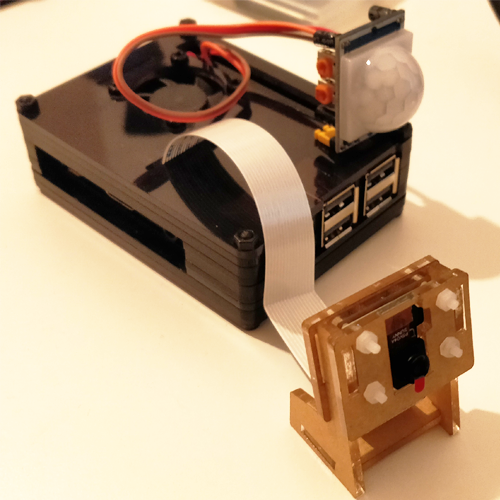

# The Guardpian


This small project uses a Raspberry Pi 3B+, a Camera and a PIR Sensor and it is used as a Security Camera.


## Requirements

- [Raspberry Pi](https://www.raspberrypi.org/) - Any version of Raspberry Pi will work.
- [PIR Motion Sensor](https://www.amazon.co.uk/gp/product/B00NFXBPU8) - A PIR motion sensor and linked to GPIO 4.
- [Pi Camera](https://www.amazon.co.uk/gp/product/B07TWHB8B4)
- Python 3 
- GIT (to clone this repo)
- A Gmail account (for sending images to other email accounts)
- IFTTT webhook (Optional)




## How it works

When starting The Guardpian, it will send you a first camera shot so you can see what the Raspberry Pi is seeing.
When the PIR Sensor captures any motion, it will trigger a camera shot to be saved and it will sent it to you via email. 
There is also an option to enable a custom IFTTT webhook, so you can do whatever you want when PIR senses any motion.
(For example, you can trigger a smart lightbulb or socket to be enabled to take photos in places with low light)

To make it work on your own Raspberry Pi, you will need Python and Git installed on your raspberry.

Plug the camera to your Raspberry and the PIR Motion Sensor using a GPIO pin (default = 4). 

To start The Guardpian, clone this repo, change the settings file removing the `.sample` suffix and then use Python to run it.

```
git clone https://github.com/jpadilladev/the-guardpian.git
cd the-guardpian
python3 -m pip install -r requirements.txt
python3 main.py
```

It is recommended to add a starting script at boot.

## Settings
You can change the default settings using `config.properties.sample`, removing the `.sample` suffix and using your own as `config.properties`.

## Debugging

You can enable debug mode in config.properties under settings section, using `debug = true`.

Enjoy!


(This project is under MIT license)

---

#### About me
[LinkedIn](https://www.linkedin.com/in/jorgepad/en)

[Personal Website](https://www.jorgepadilla.es)